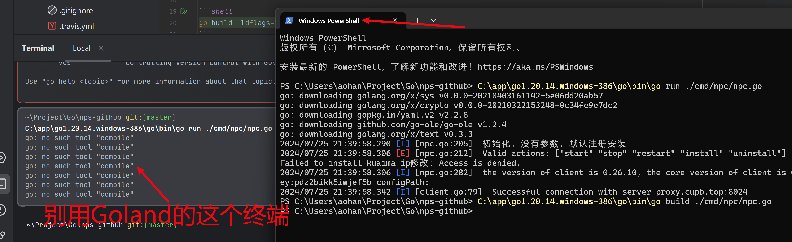

## 管理员页面

http://proxy-admin.cupb.top/login/index

后端计划这个forked仓库做开发。

https://github.com/yisier/nps

## 服务注册使用

https://ehang-io.github.io/nps/#/use?id=%E6%B3%A8%E5%86%8C%E5%88%B0%E7%B3%BB%E7%BB%9F%E6%9C%8D%E5%8A%A1

### 对于windows，使用管理员身份运行cmd

- 注册：npc.exe install 其他参数（例如-server=xx -vkey=xx或者-config=xxx）
- 启动：npc.exe start
- 停止：npc.exe stop
- 如果需要更换命令内容需要先卸载npc.exe uninstall，再重新注册
- 如果需要当客户端退出时自动重启客户端，请按照如图所示配置 

    

注册到服务后，日志文件windows位于当前目录下，linux和darwin位于/var/log/npc.log


## npc打包

windows

直接打包，使用的时候，第一次直接点击生成一个临时的keyFile.txt文件，配置好。然后第二次需要右键管理员运行。
```shell
go build ./cmd/npc/npc.go
```

```shell
C:\app\go1.20.14.windows-386\go\bin\go run ./cmd/npc/npc.go
```


第二次启动需要用任务管理器服务


powershell不行，必须管理员运行cmd

服务删除

```shell
sc delete 服务名称
```


所有服务查询

```shell
sc queryex type=service state=all
```


```shell
go build -ldflags="-w -s -extldflags -static -H windowsgui" ./cmd/npc/npc.go
```

打包32位的程序

```shell
go env -w GOARCH=amd64
```

linux下

隐藏黑窗

```shell
CGO_ENABLED=0 GOOS=windows GOARCH=amd64  go build -ldflags="-w -s -extldflags -static -H windowsgui" ./cmd/npc/npc.go
CGO_ENABLED=0 GOOS=windows GOARCH=amd64  go build -o 白沟.exe -ldflags="-w -s -extldflags -static -H windowsgui" ./cmd/npc/npc.go
```

不隐藏黑窗

```shell
CGO_ENABLED=0 go build -ldflags="-w -s -extldflags -static -H windowsgui" ./cmd/npc/npc.go
```

```shell
CGO_ENABLED=0 GOOS=windows GOARCH=amd64  go build -ldflags="-w -s -extldflags -static" ./cmd/npc/npc.go
```

> -ldflags="-H windowsgui"

32位

```shell
CGO_ENABLED=0 GOOS=windows GOARCH=386  go build -ldflags="-w -s -extldflags -static -H windowsgui" ./cmd/npc/npc.go
```

# Arm7 打包

官方有arm打包的


ubuntu 22.04下直接设置

```shell
go env -w GOARCH=arm
go env -w  GOARM=7
```

即可。

```shell
go build -ldflags="-w -s" -o kuaima-ip ./cmd/npc/npc.go
```


ARMv7	supported	GOARM=7	GOARCH=arm

GOARCH=arm GOARM=7 GOOS=linux go build

go env -w GOARCH=arm
go env -w  GOARM=7
go env -w  GOOS=linux


set GOGCCFLAGS=-fPIC -marm -pthread -Wl,--no-gc-sections -fmessage-length=0 -ffile-prefix-map=C:\Users\Eric\AppData\Local\Temp\go-build906756486=/tmp/go-build -gno-record-gcc-switches

go env -w  GOGCCFLAGS=

ip地址查询

https://www.ip138.com/
